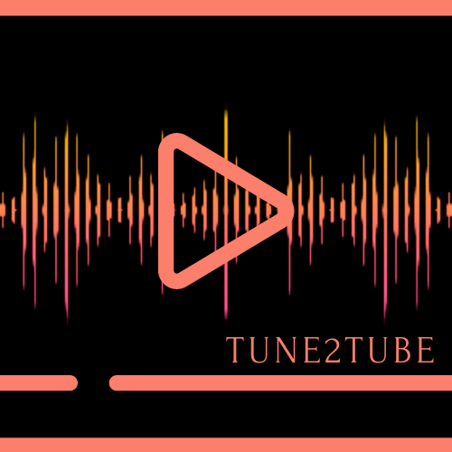

<h1 align="center"> Tune2Tube </h1>

<p align="center">
  
</p>
<p align="center">
    <a href="https://github.com/yogeshwaran01/spotify-playlist-to-youtube-playlist/stargazers"></a>
    <a href="https://github.com/yogeshwaran01/spotify-playlist-to-youtube-playlist/network">
    </a>
    <a href="https://github.com/yogeshwaran01/spotify-playlist-to-youtube-playlist/blob/master/LICENSE.txt">
    
    </a>
    <a href="https://github.com/psf/black">
    
    </a>
    
</p>

<p align="center">From Spotify's Groove to YouTube's Show: Seamless Conversion! </p>


## What is this ?

A simple python script to convert and sync your Spotify playlist into YouTube playlist.

## Usage

### Setup Spotify and YouTube

1. Go to the Google Cloud Console, sign in with your Google account, and create a new project.
2. Once your project is created, select it from the project dropdown menu in the top navigation bar.
3. Go to the Credentials page in the API & Services section of the left sidebar.
4. Click on the "Create Credentials" button and select "OAuth client ID".
5. After creating select edit button in the OAuth 2.0 Client IDs, Select application type as Desktop App and then click create.
6. Click the download button to download the credentials in your project directory. Rename the file to `client_secret.json`
7. Go to the OAuth consent screen in the API & Services section of the left sidebar. Under test user add your Gmail id.
8. Go to the Spotify Developer Dashboard and log in with your Spotify account.
9. Click on the "Create an App" button and fill out the necessary information, such as the name and description of your application.
10. Once you've created the app, you'll be taken to the app dashboard. Here, you'll find your client ID and client secret, which are used to authenticate your application with the Spotify API.
11. Add you client id and secert in `.env` file

```env
CLIENT_ID="xxxxxxxxxxxxxxxxxx"
CLIENT_SECRET="xxxxxxxxxxxxxxxx"
```

### Requirements

1. Python

2. Install all required package

```bash
pip install -r requirements.txt
```

### Running the script

```txt
Usage: main.py [OPTIONS] COMMAND [ARGS]...

  Tune2Tube

  From Spotify's Groove to YouTube's Show: Seamless Conversion!

  GitHub: https://github.com/yogeshwaran01/spotify-playlist-to-youtube-
  playlist

Options:
  --help  Show this message and exit.

Commands:
  create  Create a YouTube Playlist from Spotify Playlist
  sync    Sync your YouTube playlist with Spotify Playlist
```

#### Create a YouTube Playlist from Spotify Playlist

```bash
python main.py create <spotify_playlist_id>
```

```txt
Usage: main.py create [OPTIONS] SPOTIFY_PLAYLIST_ID

  Create a YouTube Playlist from Spotify Playlist

Options:
  --public                create a public playlist
  -n, --name TEXT         Name of the YouTube playlist to be created
  -d, --description TEXT  Description of the playlist
  --help     
```

It will open the browser for authorization. Sign up with your google account to create playlist.

use `--public` flag to create a public playlist
use `--name` to name the playlist
use `--description` to set the description of the playlist

```bash
python main.py create <spotify_playlist_id> --public
```

#### Sync your YouTube Playlist with your Spotify playlist

```bash
python main.py sync <spotify_playlist_id> <youtube_playlist_id>
```

It alson open the browser for authorization. Sign up with your google account to sync playlist.

### How this works

Refer [this](https://dev.to/yogeshwaran01/from-spotify-to-youtube-how-i-built-a-python-script-to-convert-playlists-2h89) blog post for more info

## Contact Me

If you need more info or any support please feel free to contact [me](mailto:yogeshin247@gmail.com)
